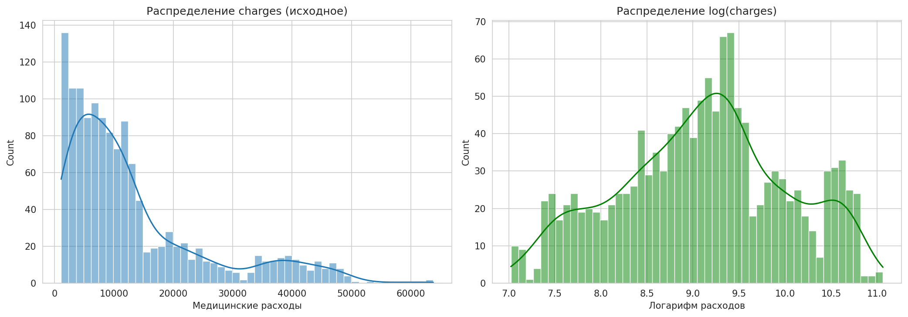
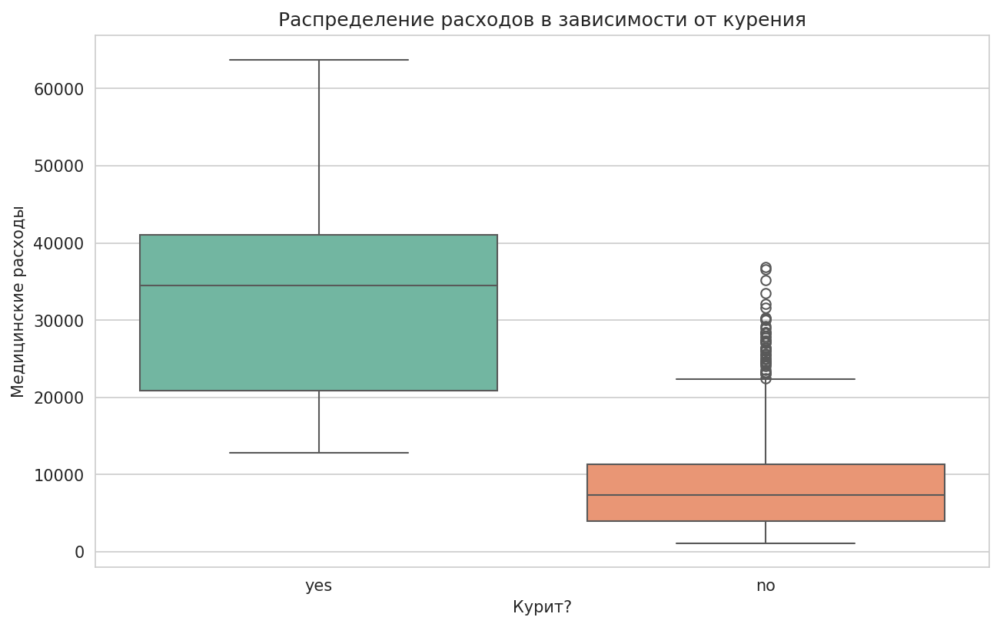
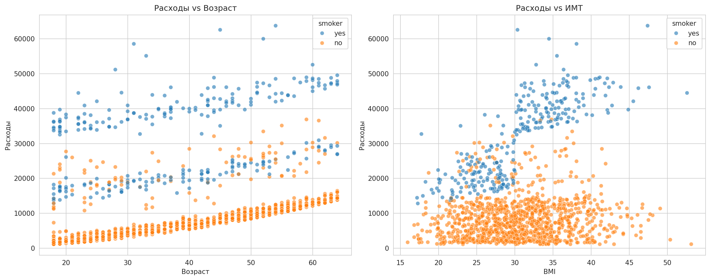
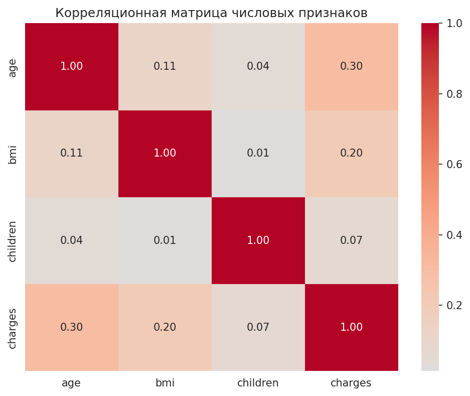
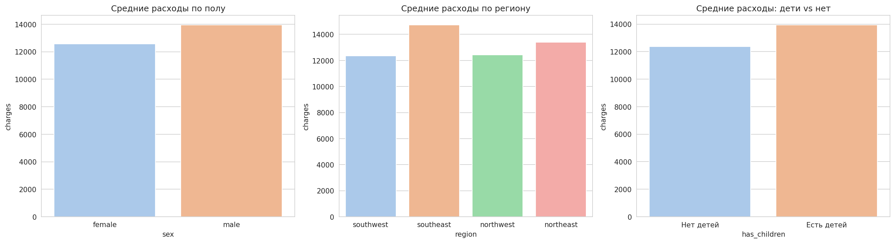
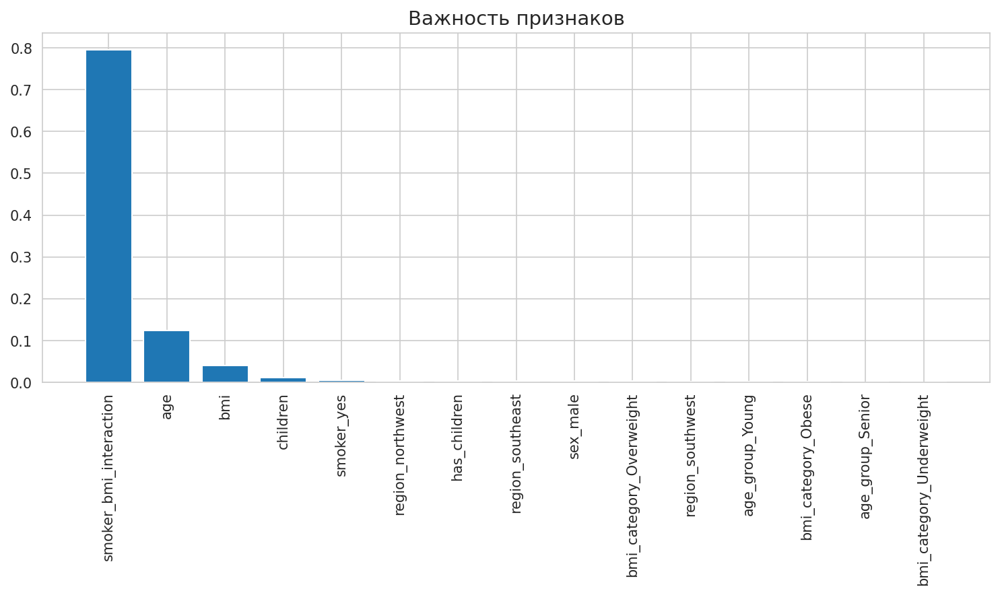

```markdown
# Анализ медицинских расходов и прогнозирование страховых выплат 🏥💰


Проект посвящен анализу факторов, влияющих на медицинские расходы, и построению ML-модели для прогнозирования индивидуальных страховых выплат (charges) на основе демографических данных и образа жизни клиента 🏥📊

Работу выполнили: **Кузнецова Алена и Селецкий Иван**, группа ИД24-1 🌸

Данные взяты из датасета Kaggle `mirichoi0218/insurance` (Medical Cost Personal Datasets). В датасете содержатся наблюдения за клиентами страховой компании: возраст, пол, ИМТ, количество детей, статус курения, регион проживания и сумма медицинских расходов.

Основная задача решается как **регрессия**: модель должна предсказывать непрерывное числовое значение страховых выплат 🎯

## Содержание 📌

- [Цель проекта](#цель-проекта)
- [Постановка задачи](#постановка-задачи)
- [Данные](#данные)
- [Структура проекта](#структура-проекта)
- [Установка и запуск](#установка-и-запуск)
- [Предобработка и feature engineering](#предобработка-и-feature-engineering)
- [EDA](#eda)
- [Моделирование](#моделирование)
- [Оценка качества](#оценка-качества)
- [Подбор гиперпараметров](#подбор-гиперпараметров)
- [Интерпретация модели](#интерпретация-модели)
- [Проверка гипотез](#проверка-гипотез)
- [Итоги](#итоги)

## Цель проекта 🌱

Цель: построить и обосновать модель машинного обучения, которая прогнозирует индивидуальные медицинские расходы на основе демографических и поведенческих признаков клиента.

Полный ML-цикл в проекте:

```text
Data -> Preprocessing -> Feature Engineering -> EDA -> Model -> Evaluation -> Interpretation
```

Что сделано ✅

- загружен и описан реальный датасет с медицинскими расходами 🏥;
- проведена очистка данных и проверка пропусков 🧹;
- выполнено кодирование категориальных признаков 🔤;
- созданы новые признаки для повышения качества модели 🛠️;
- проведен EDA с визуализациями распределений, зависимостей и корреляций 📈;
- обучены baseline, классические ML-модели и ансамблевая модель 🤖;
- рассчитаны метрики регрессии `MAE`, `RMSE`, `R2` 📏;
- выполнен подбор гиперпараметров ⚙️;
- проанализирована важность признаков 🔍;
- проверены исследовательские гипотезы 💡.

## Постановка задачи 🎯

Тип задачи: **регрессия**.

Целевая переменная:

```text
charges
```

Используемые признаки:

- `age` - возраст клиента;
- `sex` - пол;
- `bmi` - индекс массы тела;
- `children` - количество детей;
- `smoker` - статус курения;
- `region` - регион проживания;
- дополнительные признаки, созданные на этапе feature engineering.

Бизнес-смысл задачи: прогнозирование медицинских расходов помогает страховой компании устанавливать адекватную стоимость полисов, выявлять группы риска и управлять финансовыми резервами 🛒

## Данные 🗂️

Датасет загружается напрямую из GitHub:

```python
url = "https://raw.githubusercontent.com/stedy/Machine-Learning-with-R-datasets/master/insurance.csv"
df = pd.read_csv(url)
```

Основные поля датасета 📋

| Поле | Описание |
|---|---|
| `age` | возраст клиента |
| `sex` | пол (male/female) |
| `bmi` | индекс массы тела |
| `children` | количество детей на иждивении |
| `smoker` | статус курения (yes/no) |
| `region` | регион проживания (southwest, southeast, northwest, northeast) |
| `charges` | медицинские расходы, целевая переменная |

## Структура проекта 🏗️

```text
medical_cost_analysis/
├── MedicalCost_Analysis.ipynb
├── README.md
├── requirements.txt
├── medical_cost_model.pkl
└── figures/
    ├── distribution_charges.png
    ├── smoker_boxplot.png
    ├── age_bmi_scatter.png
    ├── correlation_heatmap.png
    ├── category_barplots.png
    └── feature_importance.png
```

## Установка и запуск 🚀

Клонирование репозитория:

```bash
git clone https://github.com/ezzuzz/medical_cost_analysis.git
cd medical_cost_analysis
```

Установка зависимостей:

```bash
pip install -r requirements.txt
```

Запуск ноутбука:

```bash
jupyter notebook MedicalCost_Analysis.ipynb
```

## Предобработка и feature engineering 🧹

В проекте выполнены ✨

- проверка структуры датасета 🔎;
- обработка пропусков (в данном датасете их нет) 🧩;
- кодирование категориальных признаков `sex`, `smoker`, `region` 🔤;
- выделение категорий ИМТ и возрастных групп 📅;
- создание интерактивного признака `smoker_bmi_interaction` 🥑;
- создание бинарного признака `has_children` 📐;
- логарифмирование целевой переменной для анализа ⚖️.

Примеры созданных признаков:

- `bmi_category` (Underweight, Normal, Overweight, Obese);
- `age_group` (Young, Middle, Senior);
- `smoker_bmi_interaction` (произведение статуса курения на ИМТ);
- `has_children` (есть ли дети).

## EDA 📊

В ходе разведочного анализа были изучены 🌿

- распределение медицинских расходов 💸;
- различия между курящими и некурящими 🥑;
- зависимость расходов от возраста и ИМТ 📅;
- корреляции между числовыми признаками 🔗;
- средние расходы по полу, региону и наличию детей 🗺️.

### Примеры визуализаций из проекта:



*Рисунок 1. Распределение исходных и логарифмированных медицинских расходов*



*Рисунок 2. Сравнение расходов курящих и некурящих клиентов*



*Рисунок 3. Влияние возраста и индекса массы тела на медицинские расходы*



*Рисунок 4. Корреляции между числовыми признаками*



*Рисунок 5. Сравнение средних расходов по полу, региону и наличию детей*

### Итоги EDA (минимум 3 вывода)

1. **Курение — доминирующий фактор:** курящие клиенты платят в 3-4 раза больше некурящих 🚬
2. **Возраст и ИМТ положительно коррелируют с расходами,** особенно сильно это проявляется у курящих 📈
3. **Пол и регион значимо не влияют** на средние страховые выплаты ✅

## Моделирование 🤖

Были обучены несколько моделей 🧠

- `LinearRegression` как baseline;
- `DecisionTreeRegressor`;
- `KNeighborsRegressor`;
- `Lasso`;
- `RandomForestRegressor`;
- `SVR`.

## Оценка качества 📏

Для оценки использовались метрики регрессии ✨

- `MAE` - средняя абсолютная ошибка;
- `RMSE` - среднеквадратичная ошибка;
- `R2` - доля объясненной дисперсии.

Сравнение моделей:

| Модель | MAE | RMSE | R2 |
|---|---:|---:|---:|
| LinearRegression | 4181.81 | 6000.89 | 0.783 |
| DecisionTreeRegressor | 2910.45 | 4976.88 | 0.851 |
| KNeighborsRegressor | 4239.47 | 6070.82 | 0.778 |
| Lasso | 4185.76 | 6009.82 | 0.782 |
| RandomForestRegressor | 2191.94 | 4115.40 | 0.898 |
| SVR | 6503.73 | 8555.01 | 0.559 |

Лучший результат показала ансамблевая модель `RandomForestRegressor` 🏆

## Подбор гиперпараметров ⚙️

Для лучшей модели (RandomForest) был выполнен подбор гиперпараметров через GridSearchCV. Лучшие параметры:

```text
n_estimators: 200
max_depth: 10
min_samples_split: 2
min_samples_leaf: 1
```

Лучший R2 на кросс-валидации:

```text
0.8765
```

Результат после подбора на тестовой выборке:

```text
MAE: 2163.82
RMSE: 4086.38
R2: 0.899
```

## Интерпретация модели 🔍

Для интерпретации была рассчитана важность признаков на модели `RandomForestRegressor`.



*Рисунок 6. Наиболее важные признаки для прогноза медицинских расходов*

Наиболее значимые признаки:

| Признак | Важность |
|---|---:|
| `smoker_bmi_interaction` | 0.8036 |
| `age` | 0.1241 |
| `bmi` | 0.0348 |
| `children` | 0.0103 |
| `smoker_yes` | 0.0046 |

**Вывод:** самым сильным фактором для прогноза медицинских расходов является взаимодействие курения и индекса массы тела (`smoker_bmi_interaction`). Это означает, что наибольший риск представляют **курящие люди с высоким ИМТ**. Также важны возраст и сам по себе ИМТ 🏥

## Проверка гипотез 💡

В проекте были проверены следующие статистические гипотезы:

### Гипотеза 1: Курящие имеют более высокие расходы, чем некурящие

**Результат:** T-тест показал статистически значимую разницу (p-value < 0.001). Гипотеза подтверждена ✅

### Гипотеза 2: С возрастом расходы растут

**Результат:** Корреляция Пирсона между age и charges = 0.299 (p-value < 0.001). Гипотеза подтверждена ✅

### Гипотеза 3: Люди с ожирением (BMI > 30) тратят больше

**Результат:** T-тест показал статистически значимую разницу (p-value < 0.001). Гипотеза подтверждена ✅

Основные выводы 🌟

- курение является главным фактором риска, увеличивающим расходы 🚬;
- возраст и высокий ИМТ дополнительно усиливают риски 📈;
- feature engineering (создание интеракции `smoker_bmi_interaction`) значительно улучшил качество модели 🛠️;
- ансамблевые модели (RandomForest) дают более высокое качество, чем простые baseline-подходы 🏆.

## Итоги 🌸

В проекте построен полный ML-пайплайн для прогнозирования медицинских расходов. Лучшей моделью стала `RandomForestRegressor`, которая достигла:

```text
MAE: 2163.82
RMSE: 4086.38
R2: 0.899
```

**Бизнес-ценность:** модель позволяет страховой компании предсказывать расходы клиента с ошибкой около 2160 долларов. Это помогает:

- устанавливать адекватную стоимость полисов 💰;
- выявлять клиентов из групп риска (курящие с высоким ИМТ, пожилые люди) ⚠️;
- принимать решения о профилактических программах 🩺.

Модель можно использовать как исследовательский инструмент для анализа факторов, влияющих на медицинские расходы, и как базу для дальнейшего улучшения прогноза 🏥✨

---
